# 🚀 TalentOS - AI-Powered HR Operating System

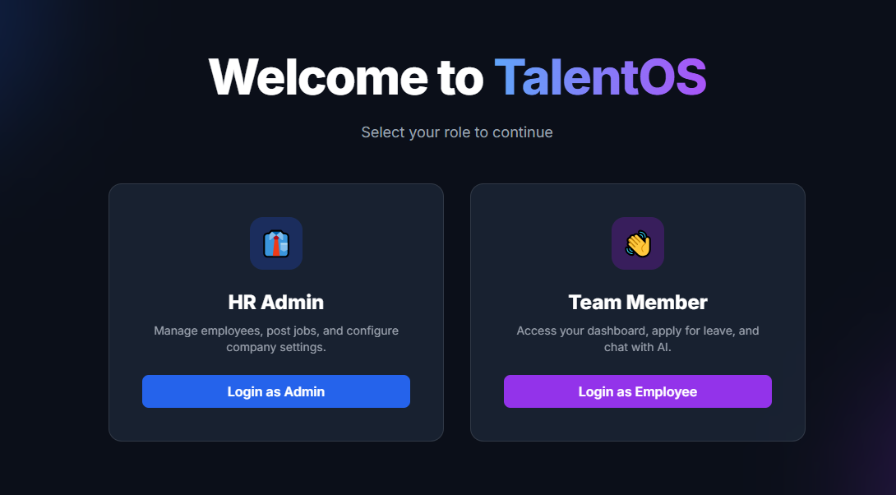

**TalentOS** is an enterprise-grade, event-driven SaaS platform designed to automate the entire lifecycle of Human Resources—from recruitment to onboarding and daily management. 

Unlike traditional HR tools that act as simple data entry forms, TalentOS acts as an **Intelligent Agent** working alongside your team. It utilizes **Generative AI (LLMs)**, **RAG (Retrieval-Augmented Generation)**, and **Asynchronous Workers** to handle complex tasks like resume scoring, policy answering, and leave approval automatically.

---

## 🏗️ Tech Stack & Architecture

* **Backend:** FastAPI (Python) - High-performance async API.
* **Task Queue:** Celery + Redis - Handles heavy lifting (PDF parsing, Emailing, AI inference) in the background without freezing the UI.
* **Database:** Supabase (PostgreSQL) - Relational data + Vector Embeddings (`pgvector`).
* **AI Engine:** Groq API (Llama-3 70B) & LangChain.
* **Frontend:** HTML5, TailwindCSS, Vanilla JS (Lightweight & Fast).

---

## 🌟 Key Features

### 1. 🔐 Role-Based Access & Security
Distinct, secure dashboards for **HR Admins** and **Employees**.
* **Admin:** Full control over employees, settings, and AI tools.
* **Employee:** Restricted access to self-service tools (Chat, Leave, Stats).

| HR Admin Login | Employee Login |
| :---: | :---: |
| 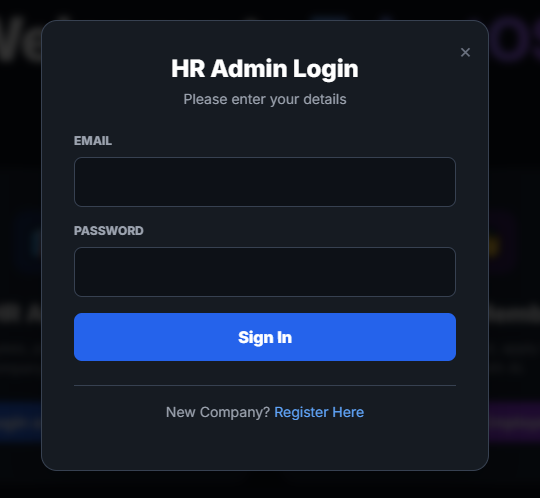 | 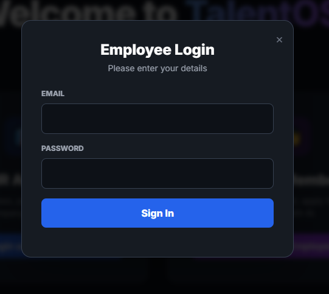 |

### 2. 👥 Automated Onboarding
When an Admin adds a new employee, the system **auto-generates a secure password** and triggers a background Celery worker to send a **Welcome Email** with credentials instantly.

| Add Employee (Admin) | Automated Welcome Email |
| :---: | :---: |
|  | 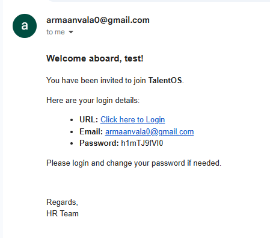 |

### 3. 🤖 AI-Driven Recruitment (ATS)
Stop reading resumes manually. TalentOS analyzes candidates for you.
* **Job Board:** Create job postings which act as the context for the AI.
* **Smart Scoring:** The AI reads the uploaded Resume (PDF/DOCX), compares it with the Job Description, and assigns a **Match Score (0-100%)** with qualitative feedback.

| Job Posting | AI Resume Scoring & Feedback |
| :---: | :---: |
| 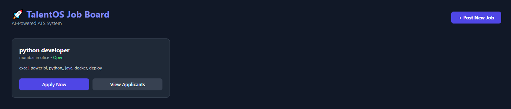 | 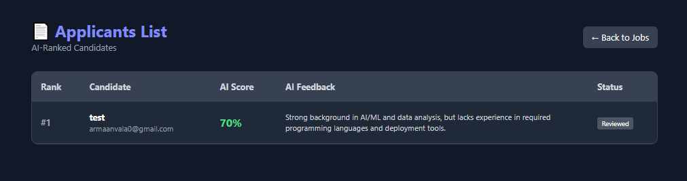 |

### 4. 📝 Intelligent Leave Management
An AI Agent that reviews leave requests based on company policy limits.
* **Employee:** Applies for leave via a simple modal.
* **AI Logic:** * *Minor requests (1-2 days, Sick)* → **Auto-Approved** ✅.
    * *Major requests (Vacation, Long duration)* → **Flagged for Human Review** ⚠️.
* **Admin Review:** Admins see a filtered list with AI suggestions to Approve or Reject.

| Employee Application | Admin Review with AI Suggestion |
| :---: | :---: |
| 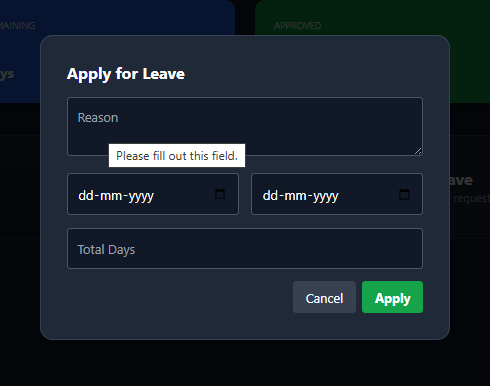 | 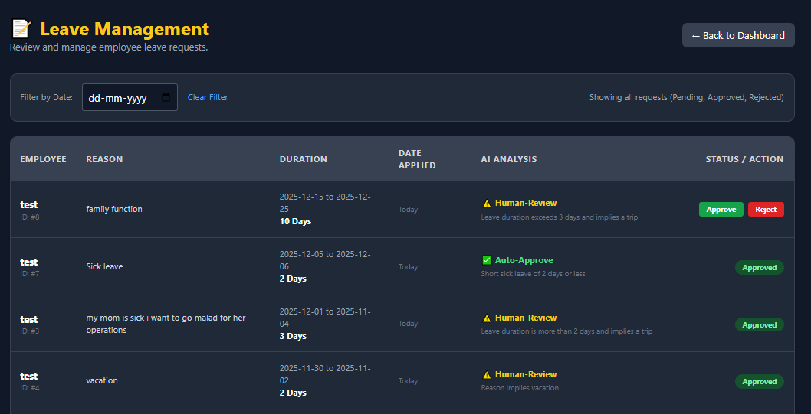 |

### 5. 🧠 RAG Knowledge Base (Policy Chatbot)
Employees no longer need to email HR for every small question.
* **Upload:** Admin uploads policy documents (PDF/DOCX).
* **Vector Search:** Documents are chunked and stored in Supabase.
* **Chat:** Employees ask questions like *"What is the work from home policy?"* and get accurate answers grounded in the uploaded docs.

| Knowledge Base Upload | Context-Aware Chatbot |
| :---: | :---: |
| 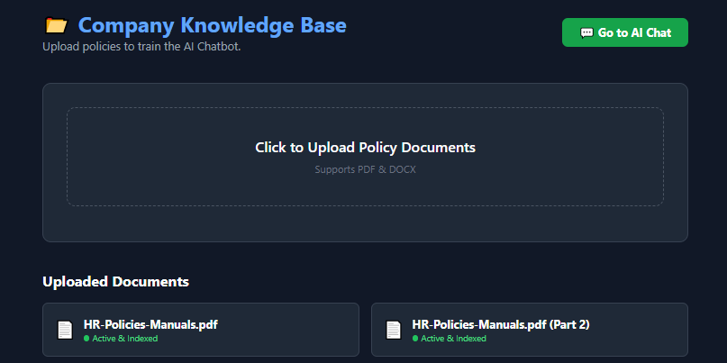 | 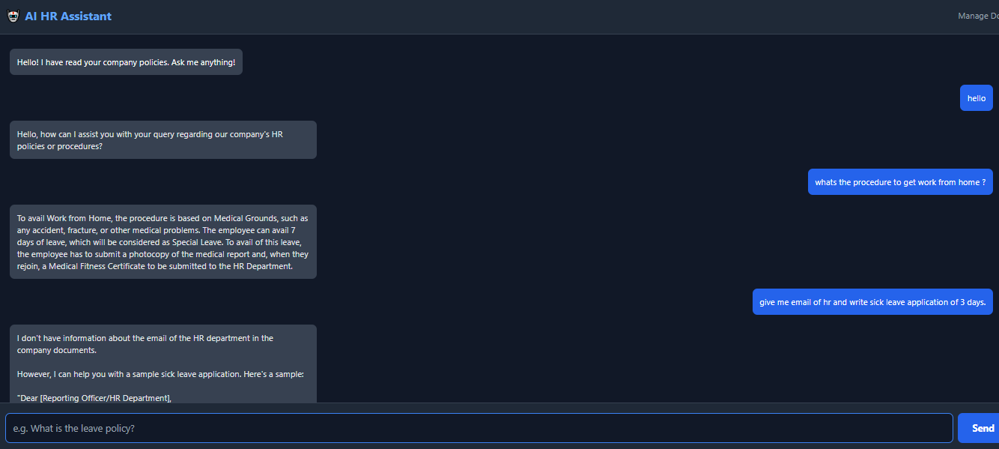 |

### 6. 🛠 Productivity Tools
Integrated tools to speed up daily workflows.
* **Bulk Emailer:** Send updates to the whole organization asynchronously.
* **Meeting Scheduler:** Create Google Calendar events using structured input.

| AI Email Sender | Meeting Scheduler |
| :---: | :---: |
|  | 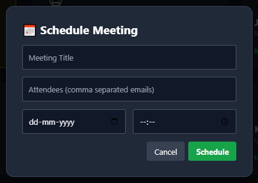 |

---

## 📊 Dashboards Overview

### Admin Dashboard
A command center for HR to monitor leave requests, manage tools, and configure company settings.
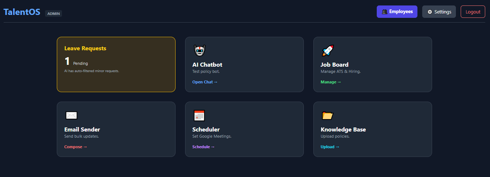

### Employee Dashboard
A clean, personal space for employees to track their leave balance, applied status, and access the AI assistant.
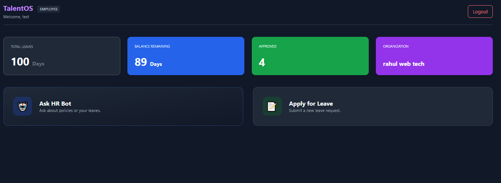

---

